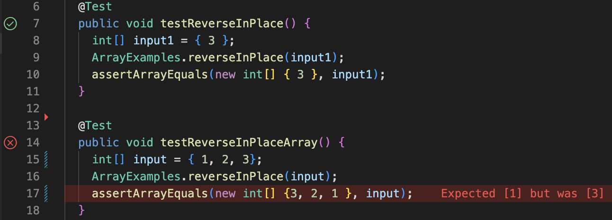

# Lab Report 2
Jesus Gonzalez - CSE 15L - A17425808 - Jan 29, 2023

---
## Part 1 - String Server
The folowing is the code creating the web server that keeps track of a single string that gets added to by incoming requests.

The request should look like this `/add-message?s=<string>`.

The request results in concatenating a new line containing the string after = to the running string, and then respond with the entire string so far.

### Examples

1. In this image lines 8-11 of the code are running. This means that when the StringServer is opened up and the handle request method is called to handle the url, the string is intially displayed, however, the string is still empty at this point.


2. In this image the handle request method is called and runs lines 13-18. This is because the method checks to see what the path of the url is. When the method checks to see if the path of the url only contains a /, however it does not. Then the method checks to see if the url contains the String `/add-message`. This is true, so the method spilts the rest of the path from the equals sign. The left side of the string, which is always s the reference to the string keeping track of incoming requests, takes in the right side, which is also a string that gets added to the reference s.


3. In this image the handle request method is called once again and runs lines 13-18. This is because the method again checks the path of the url. When the url path is not just a slash, the first if statement in the method is passed over, the next statement checks for the `/add-message`, which comes out as true. The query is then split at the equals sign into a String array. Parameter zero of this array becomes the reference s that the right side is concatinated to.


## Part 2 - Bugs and Symptons, Debugging, and Testing

**Failure Inducing Input**
```
  @Test
  public void testReverseInPlaceArray() {
    int[] input = { 1, 2, 3};
    ArrayExamples.reverseInPlace(input);
    assertArrayEquals(new int[] {3, 2, 1 }, input);
  }
```
**Non-Failure Inducing Input**
```
  @Test
  public void testReverseInPlace() {
    int[] input1 = { 3 };
    ArrayExamples.reverseInPlace(input1);
    assertArrayEquals(new int[] { 3 }, input1);
  }
```
**The Sympton**


**Berfore**
```
  static void reverseInPlace(int[] arr) {
    for(int i = 0; i < arr.length; i += 1) {
      arr[i] = arr[arr.length - i - 1];
    }
  }

```
**After**
```
  static void reverseInPlace(int[] arr) {
    for(int i = 0; i < (arr.length/2); i += 1) {
      int temp = arr[i];
      arr[i] = arr[arr.length - i - 1];
      arr[arr.length - i - 1] = temp;
    }
  }
```
The bug in the method reverseInPlace is that there is no temporary value to save lost indexes that become overwritten. Also the for loop goes over the entire array meaning it reverses the order, then once the halfway point is reached in the indexes of the array it gets reversed again.

So creating a temporay int variable called temp to hold the value that is being overwritten and use it to asign the opposite end of the array fixes the part of the bug where indexes are being overwritten and lost. However, just doing this is not enough as the for loop will just reverse the order as the loop reaches the halfway point of the array, and reverse the order again as it runs over the second half. To fix this, the for loop condition is divided by two so the for loop only runs over half the array.

## Part 3 - What I Learned
From lab 2, I actually gained a lot of valuable skills. First of all I gained a way better idea of all the different parts of a url. And how a url is used to actually access things on the world wide web. When creating the most simple search engine I gained a very good understanding of how the path, query, and paramaters all work together to give information and actually do things.

From lab 3, I learned a lot about how to make my own tests. I knew how testing worked because of CSE 11, however I did not know how to create and actually use my own testing file, which I know do.


