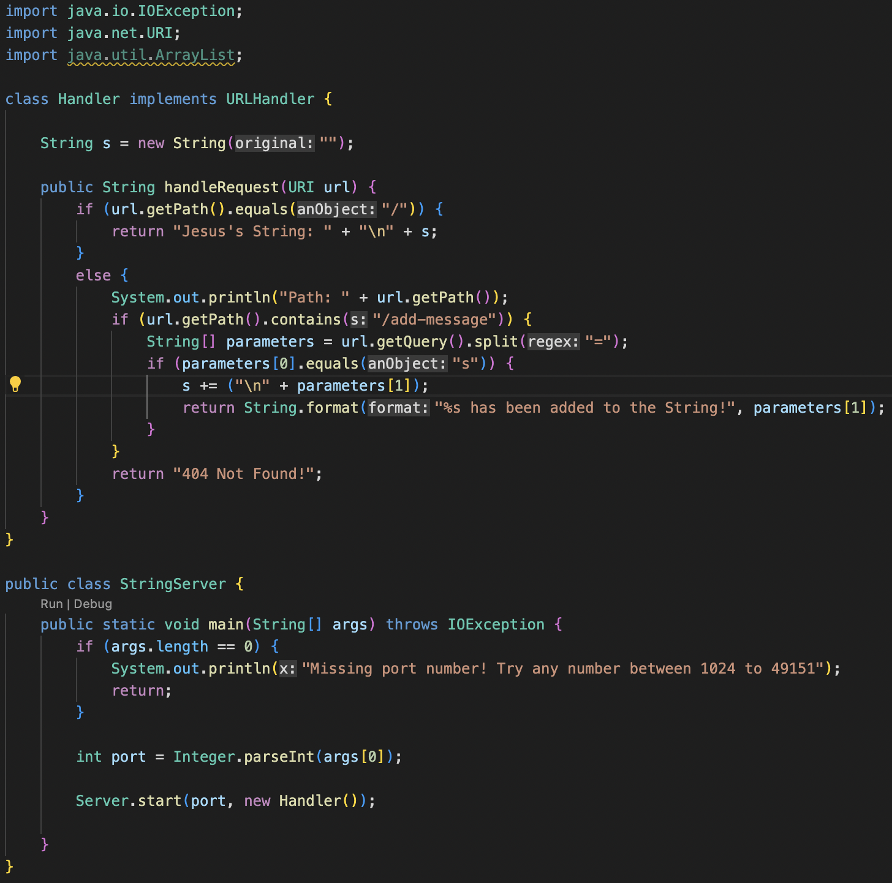
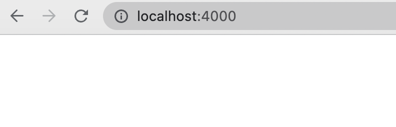
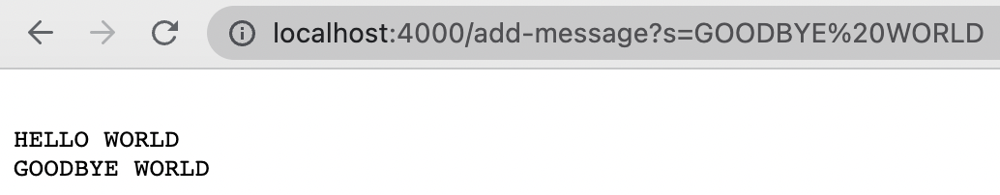

# Lab Report 2
Jesus Gonzalez - CSE 15L - A17425808 - Jan 29, 2023

---
## String Server
The folowing is the code creating the web server that keeps track of a single string that gets added to by incoming requests.

The request should look like this `/add-message?s=<string>`.

The request results in concatenating a new line containing the string after = to the running string, and then respond with the entire string so far.

##### Examples

In this image lines 8-11 of the code are running. This means that when the StringServer is opened up and the handle request method is called to handle the url, the string is intially displayed, however, the string is still empty at this point.

In this image the handle request method is called and runs lines 13-18. This is because the method checks to see what the path of the url is. When the method checks to see if the path of the url only contains a /, however it does not. Then the method checks to see if the url contains the String `/add-message`. This is true, so the method spilts the rest of the path from the equals sign. The left side of the string, which is always s the reference to the string keeping track of incoming requests, takes in the right side, which is also a string that gets added to the reference s.

In this image the handle request method is called once again and runs lines 13-18. This is because the method again checks the path of the url. When the url path is not just a slash, the first if statement in the method is passed over, the next statement checks for the `/add-message`, which comes out as true. The query is then split at the equals sign into a String array. Parameter zero of this array becomes the reference s that the right side is concatinated to.

